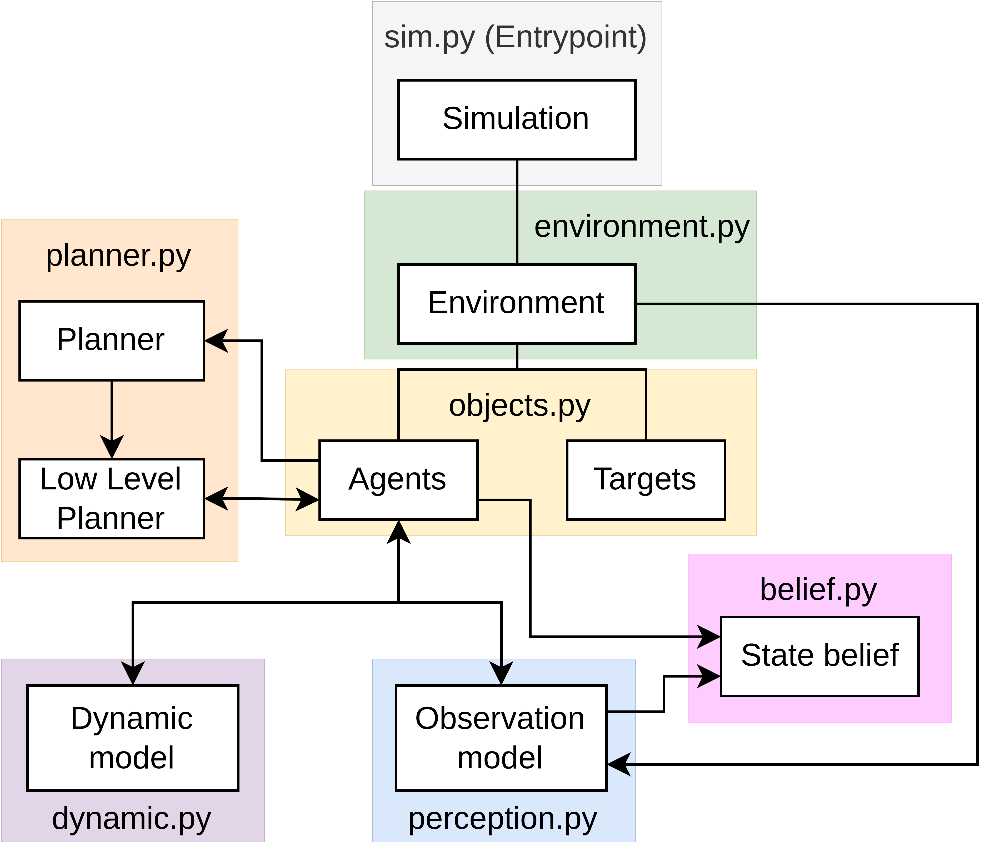

# Robot Simple Sim

This is a simple simulator to implement basic robotics modules and algorithms.
The idea is to abstract modules so they can be interfaced simply. A simplistic example showcasing the design is shown in this image:

  

The lines show relations between the components and the arrows show the flow of data. The basic files with their functions are:

* `sim.py`: This is the main file that runs the simulation. It is the only file that needs to be run. The simulation calls update on the different modules.

* `objects.py`: This file contains the classes for the objects in the simulation. The current main classes are `Agent` and `Target`.

* `environment.py`: This file contains the different environment classes. Environments define global properties and hold references to agents and targets. They also manage all the visualization part. The environment is responsible for managing unique identifiers for the agents and targets (UID).

* `visualization.py`: This file contains tools for visualizing the simulation and handle all the plots. TODO: Add in diagram.

* `dynamic.py`: This file contains the dynamic classes. Dynamics define the behavior of agents and therefore are strictly associated to an agent. They are called in the update of the agent.

* `perception.py`: This file contains the perception classes. Perceptions define the perception of agents and therefore are strictly associated to an agent. They can be called to obtain measurements from the environment. This is currently done in before the belief update in the simulation.

* `belief.py`: This file contains the belief classes (currently a ExtendedKalmanFilter). Beliefs are not associated to any agent or environment. They should store a dynamic and perception models if neccessary. They are managed in the simulation.

* `planner.py`: This file contains the planner classes. Planners can be high or low level. They store an associated agent and can modify their dynamic model parameters (i.e., send input commands).

The basic behavior with all the modules interacting can be observed in the `sim.py` file. Adding the components to the environment mainly serves the purpose of including its visualization to the plot. The visualization is updated iteractively with the update function of each component.